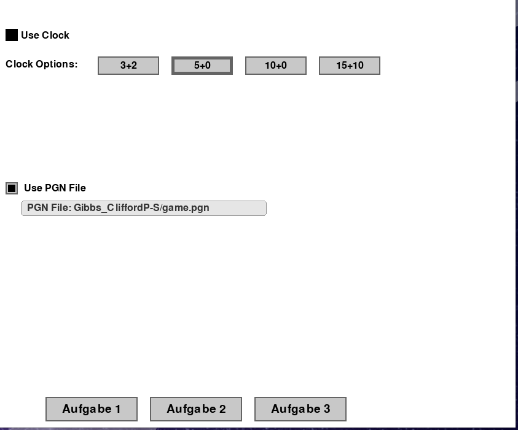
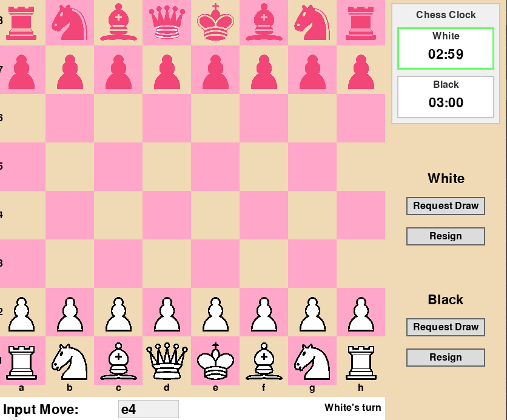
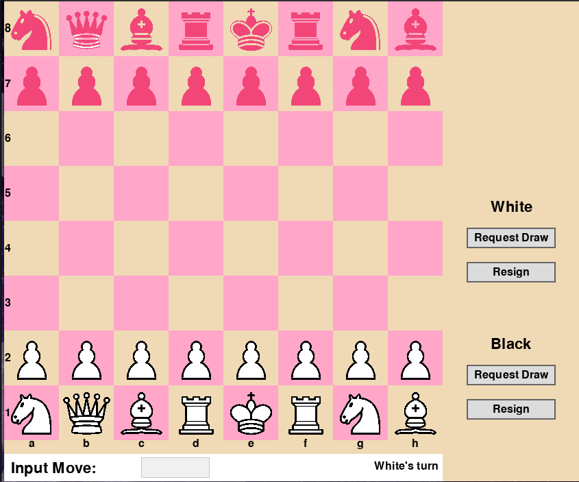
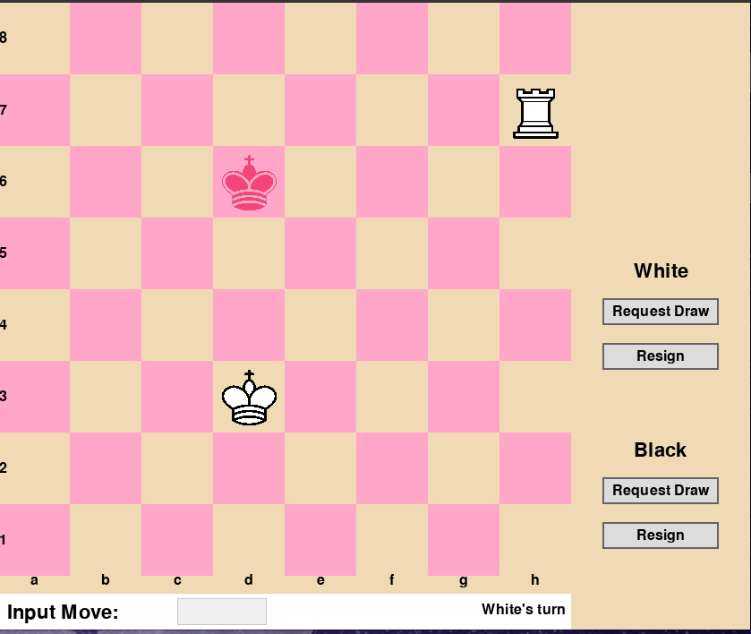
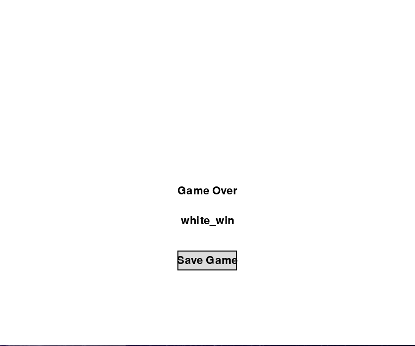

# Chess Program Documentation

## Members
This project is made by:
- Liv Richter
  - Has implemented Chess960 and castling
- Bhavya Sharma
  - Has implemented the rook+king vs king mode
- Oliver Baumgartner
  - Has implemented the game logic, drawing and standard chess mode

## Presentation
### Start Screen
When opening the game you can choose between the different modes we had to implement:
- Normal Chess
- Chess960
- Strategic rook+king vs king
  
You cann choose these options with the three buttons on bottom.
You can also set:
- Clock for during the game. Here you have different modes (time (m) + increment (s)). 
- You can choose to load a game from a pgn file in standard chess notation. For that please refer to the example game in "game.pgn". When this options is selected you can't manually enter moves. All moves are automically loaded from the file and you can press enter to play the next move. The file "game.pgn" contains a difficult match, which the game handles perfectly.


### Game
#### Normal Mode
when the game is loaded you can make a move by just starting to write on your keyboard. You will see the move written in the bottom. **But in case you use a PGN File** you can just press enter and the moves are loaded one by one. On the right side you see the clock, which automatically increments when the player changes. You can always request a draw or resign.


#### Chess960
You can also choose to play the two other modes. The logic for handling the game is simmilar here. But the starting positon in Chess960 is choosen random according to the rules. Also castling is handled specialy because you have to look at more special cases.


### Rook+King vs King endgame
In the endgame Rook+King vs King mode, you can play the moves of black and the computer moves white. The computer will checkmate you in 50 moves. This algorithm is implemented with the "Box Method"


### End Screen
When a checkmate is detected or a draw is agreed on, the end screen is loaded. Here you can see the winner and save the game to a textfile. It will generate a textfile in which all the moves are written in standard chess notation. This will be saved on your computer.


## 1. Libraries and Installation

This chess program uses the following Python libraries:
- `pygame`: For the graphical user interface

### Installation

1. Ensure you have Python 3.10 or higher installed
2. Install the required external library:
   ```
   pip install pygame
   ```
3. Run the program:
   ```
   python chess.py
   ```

## 2. Code Structure

The program is organized into several classes:

### PieceType (Enum)
- Defines the types of chess pieces (PAWN, KNIGHT, BISHOP, ROOK, QUEEN, KING)

### Clock
- Manages time control for chess games
- Tracks time for both players
- Handles time increments
- Provides formatted time display

### Game
- Main class that orchestrates the chess game
  - it has a board class as member which it controls
- Handles user interactions and game state
- Manages the UI elements and input processing
  - Drawing and of all button and function of all buttons is done here
- Parses chess notation into moves
  - When a move is parsed the function in the Board class is called
- Tracks game modes and results

### Board
- Represents the chess board and its state
- Manages piece placement and movement
- Handles board visualization
- Validates chess rules like check and checkmate
- Provides methods for special moves (castling, promotion)

### Move
- Data structure to represent a single chess move
- Stores source and destination coordinates
- Tracks if a move is a capture

### Piece
- Represents individual chess pieces
- Calculates valid moves for each piece type
- Tracks piece color, position, and movement history

## 3. Control Flow: Move Processing

The chess program follows a detailed control flow for processing moves:

### Input Handling
1. The program waits for keyboard input in the `update()` method of the `Game` class
2. When the user presses Enter, it triggers move validation with the current input text
3. The input text is expected to be in standard chess notation (e.g., "e4", "Nf3", "O-O")

### Move Parsing and Execution
1. The `play_move(text_move)` method parses the input:
   - Special cases are handled first (castling with "O-O" or "O-O-O")
   - All special cases for inputs are handled

2. Parsing logic:
   - For castling: Identifies king and rook positions, validates empty squares and absence of checks. **In Chess 960 castling is handled specialy**
   - For pawn moves: Determines the file and rank coordinates
   - For piece moves: Identifies the piece type and target position
   - For captures: Finds pieces that can capture at the target square
   - For promotions: Promotes pawns on the 8th/1st rank
   - When a check or checkmate in the chess notation is detected the move is made and later we confirm with our own logic of check and checkmate if the claim was true.

3. Move validation:
   - The `move_piece()` method identifies candidate pieces that could make the move
   - It filters the pieces based on source constraints (if any)
   - It verifies:
      - the moves are legal according to chess rules
      - Only one piece can make this move so it's not ambigouus
   - It ensures the move doesn't leave the king in check

4. Board update:
   - When a valid move is found, the board state is updated
   - Special cases like castling move two pieces
   - Captured pieces are removed
   - Piece positions are updated

5. Game state checks:
   - After each move, the game checks for:
     - Check conditions
     - Checkmate
     - Time expiration (if clocks are used)
     - Draw offers

6. Turn switching:
   - After a successful move, the turn switches to the other player
   - The clock is switched if enabled
   - The next move from a PGN file is loaded if using file playback

## 4. Sources and References

The implementation of this chess program was informed by several resources:

### Chess Rules and Algorithms
- Basic chess rules and notation: [FIDE Laws of Chess](https://www.fide.com/FIDE/handbook/LawsOfChess.pdf)
- Chess960 (Fischer Random) rules: [Chess960 Official Rules](https://www.chess.com/article/view/chess960-fischer-random-explained)
- Rook + King vs King endgame: [Chess Stack Exchange](https://chess.stackexchange.com/questions/8647/end-game-king-an-rook-beginners?utm_source=chatgpt.com)
- Chess standard notattion: [Chess.com](https://www.chess.com/terms/chess-notation)

### Programming Resources
- Pygame documentation for GUI implementation: [Pygame Documentation](https://www.pygame.org/docs/)
- We used generative AI (ChatGPT) for our project